# 🏠 WGGN Zero Trust Homelab — Monitoring & Security Lab

> A hands-on homelab built from physical hardware, focused on infrastructure monitoring and practical cybersecurity skills using open-source tools.


---

## 📋 Table of Contents

1. [Project Overview](#project-overview)
2. [Goals & Objectives](#goals--objectives)
3. [Hardware Inventory](#hardware-inventory)
4. [Lab Environment](#lab-environment)
5. [Network Topology](#network-topology)
6. [Phase 1 — Firewall Setup (OPNsense)](#phase-1--firewall-setup-opnsense)
7. [Phase 2 — Ubuntu Server Setup (wggnlab1)](#phase-2--ubuntu-server-setup-wggnlab1)
8. [Phase 3 — Monitoring Stack (Prometheus + Grafana)](#phase-3--monitoring-stack-prometheus--grafana)
9. [Phase 4 — Security Testing (Kali Linux)](#phase-4--security-testing-kali-linux)
10. [Phase 5 — Security Hardening](#phase-5--security-hardening)
11. [Troubleshooting Log](#troubleshooting-log)
12. [Key Lessons Learned](#key-lessons-learned)
13. [IP Address Reference](#ip-address-reference)

---

## Project Overview

This project documents the design, deployment, and operation of a personal homelab environment focused on **infrastructure monitoring** and **practical cybersecurity**. The lab simulates a real-world small network using physical hardware and open-source tools, with the goal of detecting and analyzing security events in real time.

**Core Stack:** OPNsense · Docker · Prometheus · Grafana · Node Exporter · Kali Linux · Fail2ban

---

## Goals & Objectives

- Deploy a physical firewall using OPNsense to control network traffic
- Stand up a containerized monitoring stack (Prometheus + Grafana) on Ubuntu Server
- Use Kali Linux to simulate real attack traffic against the lab environment
- Detect and visualize security events using Grafana dashboards
- Harden the Ubuntu Server against brute-force attacks using Fail2ban

---

## Hardware Inventory

| Device | Role | Notes |
|---|---|---|
| Fanless Mini PC | OPNsense Firewall / Router | Passive cooling, 4x NIC ports |
| HP Mini Desktop | Ubuntu Server — wggnlab1 | 56.88GB disk, Ubuntu 22.04 |
| NETGEAR Managed Switch | Network Switch | 8-port |
| HP Laptop | Management / Windows Client | Windows 11 |
| Kali Linux Machine | Security Testing | Nmap, Hydra, wordlists |
| Open-frame rack | Physical housing | Desktop server rack |

---

## Lab Environment

> The physical setup — this is what the lab looks like in the real world.

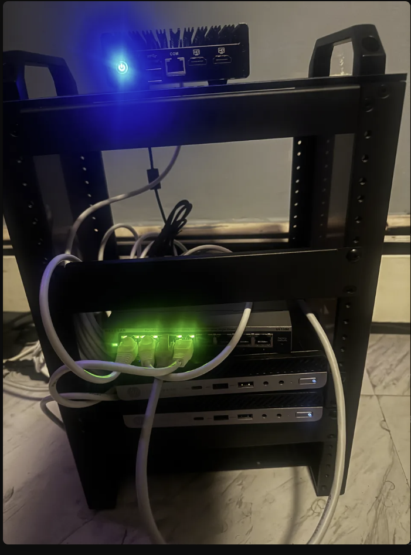
*Open-frame rack: OPNsense firewall mini PC on top (blue power LED), managed switch in the middle (green active port LEDs), and HP mini desktops at the bottom for compute*

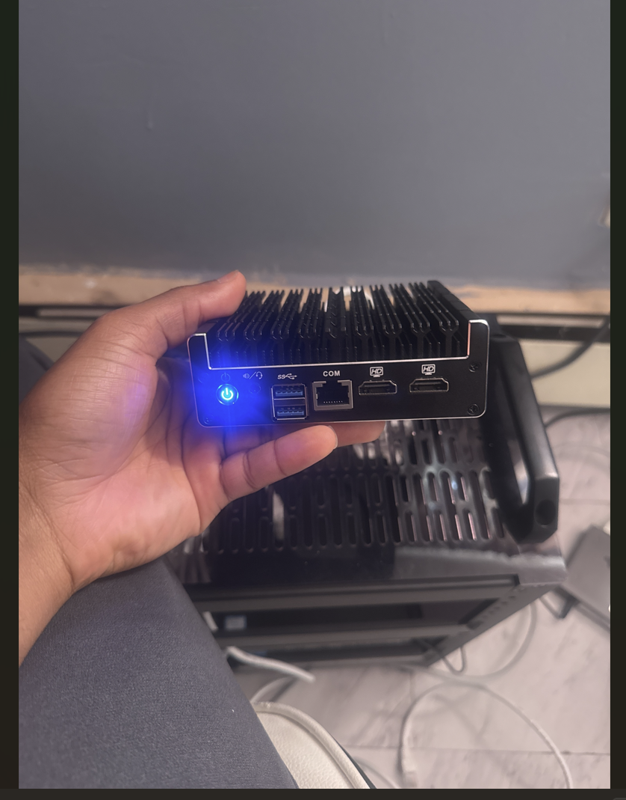
*The fanless mini PC running OPNsense — passive cooling fins, dual HDMI, USB 3.0, COM port, and a single LAN port on the front panel*

---

## Network Topology

The lab follows a straightforward architecture: ISP → Firewall → Switch → Endpoints on a flat LAN.

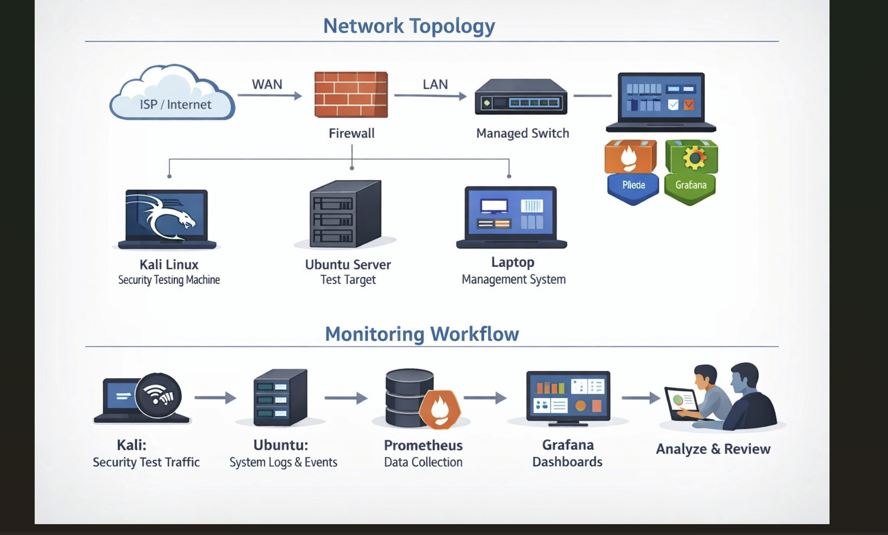
*Full network topology (top) and monitoring workflow (bottom) — Kali generates attack traffic, Ubuntu logs events, Prometheus collects metrics, Grafana visualizes everything*

### Network Layout

| Segment | Subnet | Purpose |
|---|---|---|
| WAN | DHCP from ISP | Internet uplink via OPNsense igc0 |
| LAN | 192.168.10.0/24 | Lab network via OPNsense igc1 |

---

## Phase 1 — Firewall Setup (OPNsense)

OPNsense was installed on the fanless mini PC. One NIC was assigned WAN and one LAN, providing firewall and routing for the entire lab network.

### Interface Configuration

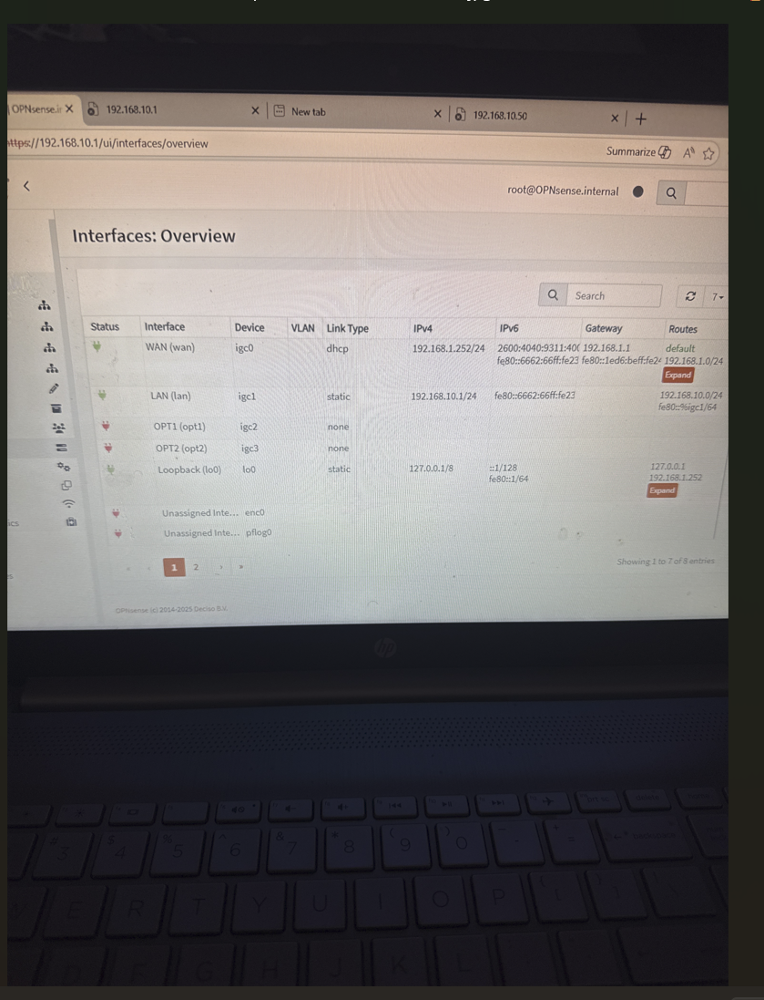
*OPNsense Interfaces Overview — WAN on igc0 via DHCP, LAN on igc1 as static 192.168.10.1/24*

**Interface assignments:**

```
WAN  → igc0  → DHCP (ISP)  → 192.168.1.252/24
LAN  → igc1  → Static      → 192.168.10.1/24
```

**Firewall rules configured:**
- Allow LAN → WAN (outbound internet access)
- Restrict OPNsense management UI access to LAN only

### DHCP Configuration

OPNsense Kea DHCP was configured on the LAN interface to automatically assign IPs in the 192.168.10.0/24 range. The management laptop received 192.168.10.50 and the Ubuntu server was assigned 192.168.10.102.

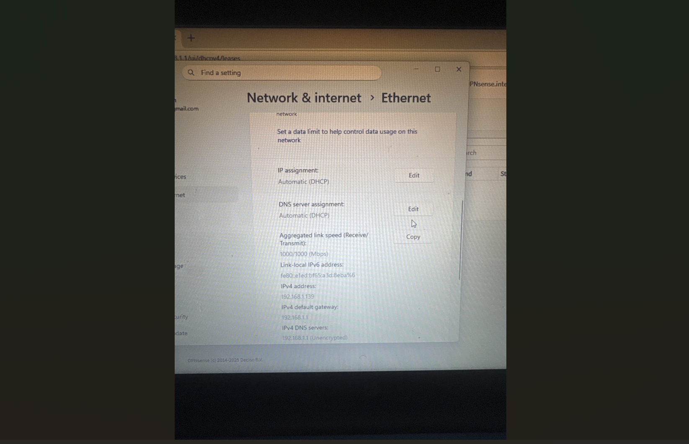
*Windows Network & Internet → Ethernet settings confirming the management laptop received its IP via DHCP with OPNsense set as the default gateway and 1000/1000 Mbps link speed*

---

## Phase 2 — Ubuntu Server Setup (wggnlab1)

Ubuntu Server 22.04 was installed on the HP mini desktop. Docker was used to containerize the monitoring stack, keeping the host OS clean and the stack easily reproducible.

### Server Stats at Time of Configuration

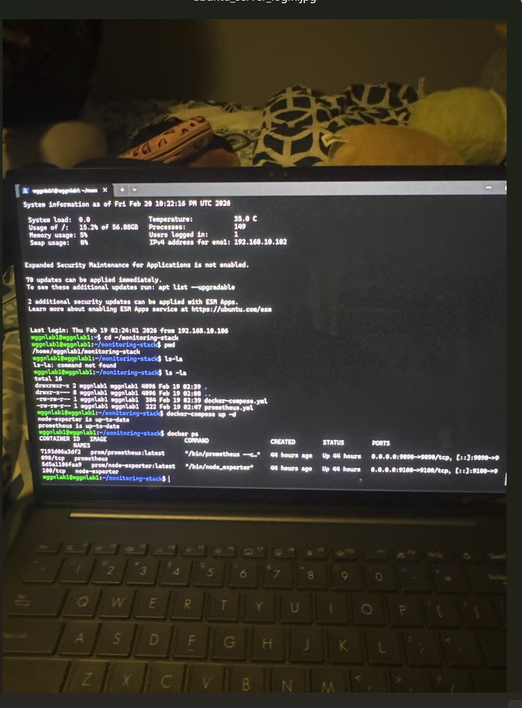
*Ubuntu Server system info: 35°C temperature, 15.2% disk usage on 56.88GB, 149 processes, 5% memory usage. Docker ps confirms prometheus (port 9090) and node-exporter (port 9100) containers are running*

### Monitoring Stack File Structure

```
~/monitoring-stack/
├── docker-compose.yml    (384 bytes)
└── prometheus.yml        (222 bytes)
```

### docker-compose.yml

```yaml
services:
  prometheus:
    image: prom/prometheus:latest
    ports:
      - "9090:9090"
    volumes:
      - ./prometheus.yml:/etc/prometheus/prometheus.yml

  node-exporter:
    image: prom/node-exporter:latest
    ports:
      - "9100:9100"

  grafana:
    image: grafana/grafana:latest
    ports:
      - "3000:3000"
```

### prometheus.yml

```yaml
global:
  scrape_interval: 15s

scrape_configs:
  - job_name: 'node-exporter'
    static_configs:
      - targets: ['node-exporter:9100']
```

---

## Phase 3 — Monitoring Stack (Prometheus + Grafana)

Once the containers were running, Grafana was accessed on port 3000 and configured with Prometheus as the data source. The Node Exporter Full dashboard was imported to monitor the Ubuntu server in real time.

### All Containers Running

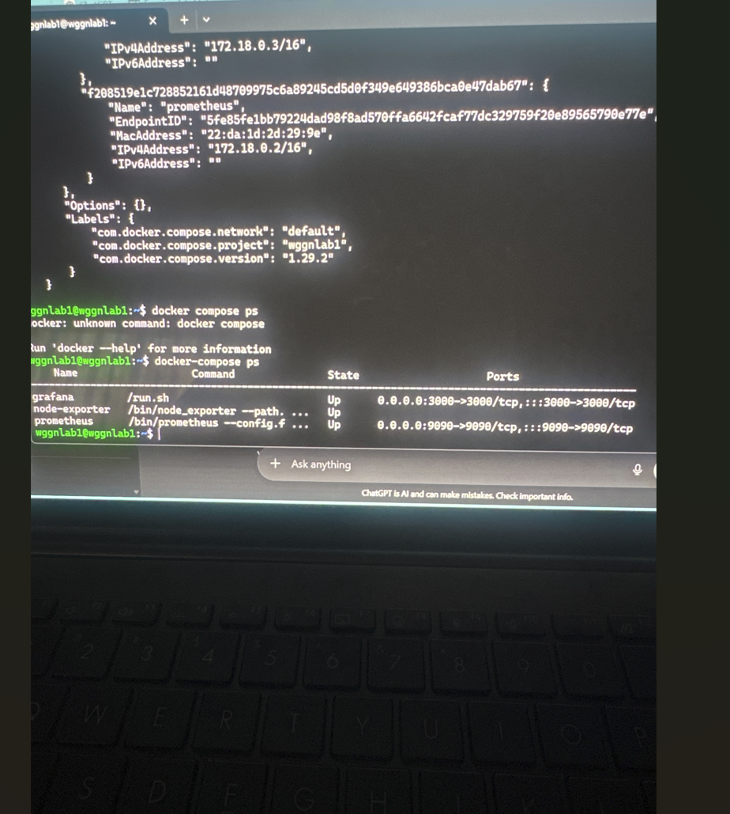
*docker-compose ps confirms all three services are Up — grafana on port 3000, node-exporter on port 9100, and prometheus on port 9090*

### Grafana — Network Traffic Dashboard

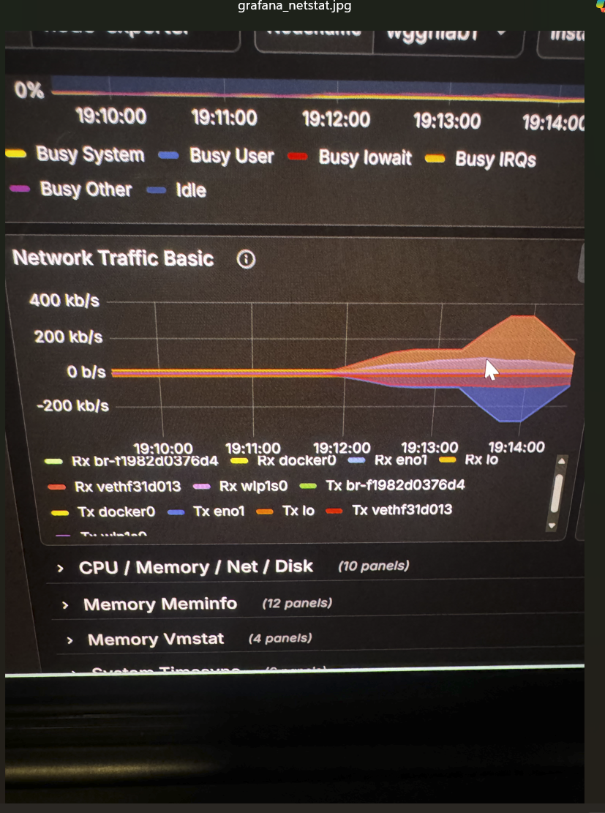
*Grafana Network Traffic Basic panel showing real-time Rx/Tx across all interfaces. A traffic spike is visible around 19:13 corresponding to Kali security testing activity*

### Grafana — Node Exporter Netstat

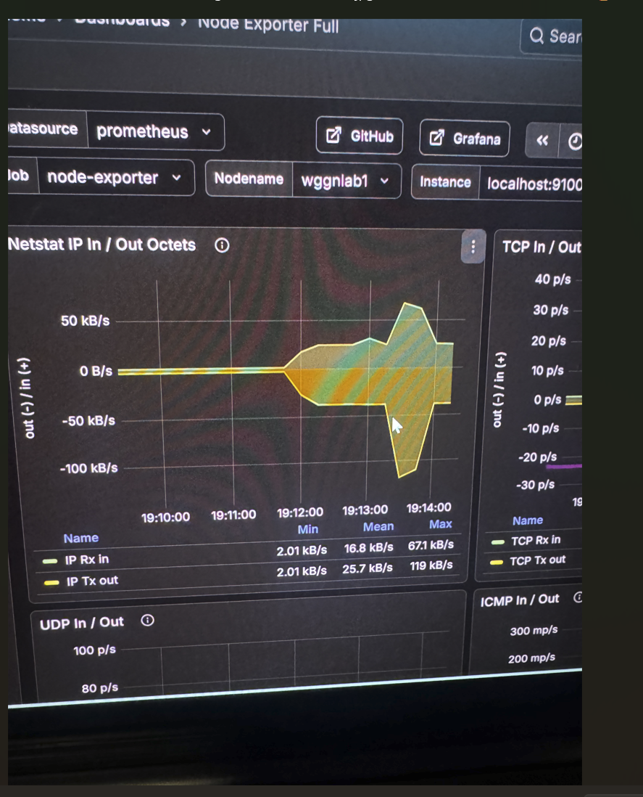
*Node Exporter Full dashboard — Netstat IP In/Out Octets panel. IP Rx peaked at 67.1 kb/s and Tx peaked at 119 kb/s during the security testing window (19:12–19:14)*

---

## Phase 4 — Security Testing (Kali Linux)

Kali Linux was used as the attacker machine to generate realistic security test traffic against the Ubuntu server. This validated that the monitoring stack could detect and display suspicious network activity in Grafana.

### Nmap Port Scan

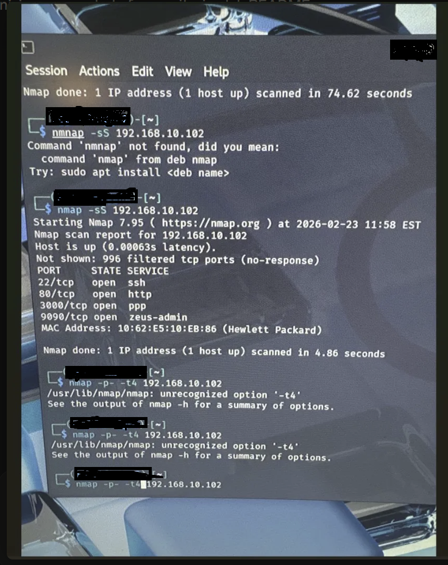
*Nmap SYN scan against 192.168.10.102 — discovered 4 open ports: SSH (22), HTTP (80), Grafana (3000), and Prometheus (9090). Scan completed in 4.86 seconds*

**Open ports discovered:**

| Port | Service | Notes |
|---|---|---|
| 22/tcp | SSH | Remote management |
| 80/tcp | HTTP | Web server |
| 3000/tcp | Grafana | Monitoring dashboard |
| 9090/tcp | Prometheus | Metrics collector |

### Hydra SSH Brute-Force Test

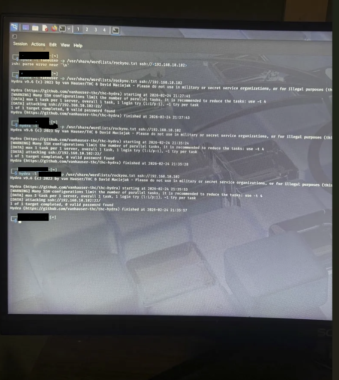
*Hydra v9.6 SSH brute-force test against 192.168.10.102 using the rockyou.txt wordlist — 0 valid passwords found across three attempts. This activity generated the traffic spike visible in the Grafana dashboards*

---

## Phase 5 — Security Hardening

After confirming the monitoring stack could detect attack traffic, Fail2ban was installed on the Ubuntu server to automatically block IPs that trigger repeated SSH login failures.

### Fail2ban Installation

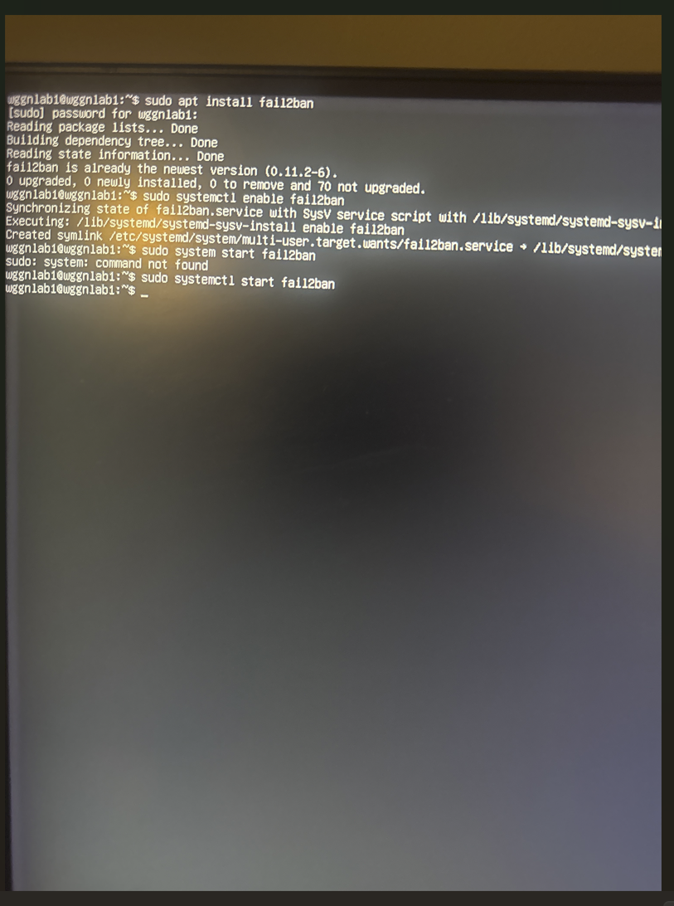
*Fail2ban 0.11.2-6 installed via apt. systemctl enable created the systemd symlink for automatic startup on boot. Service started successfully with sudo systemctl start fail2ban*

**Fail2ban configuration applied:**
- Monitored service: SSH (port 22)
- Ban threshold: 5 failed login attempts
- Ban duration: 10 minutes
- Find time window: 10 minutes

---

## Troubleshooting Log

Real errors encountered and resolved during the project build.

---

### ❌ Issue 1 — Prometheus YAML Parse Error

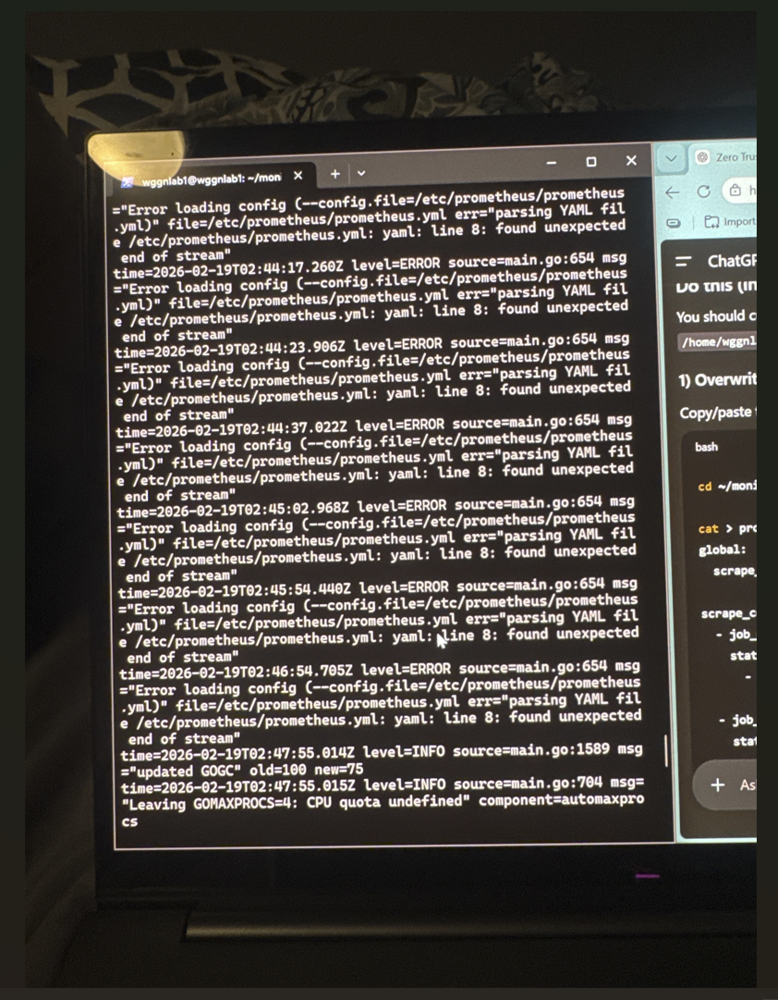
*Prometheus repeatedly logging "yaml: line 8: found unexpected end of stream" — caused by incorrect indentation in prometheus.yml*

**Error message:**
```
parsing YAML file /etc/prometheus/prometheus.yml:
yaml: line 8: found unexpected end of stream
```

**Root cause:** Incorrect indentation in `prometheus.yml`. YAML is whitespace-sensitive — a missing indent under `static_configs` caused the parser to fail.

**Fix:** Rewrote prometheus.yml with correct 2-space indentation and validated the structure before restarting the container.

---

### ❌ Issue 2 — docker-compose Grafana Regex Error

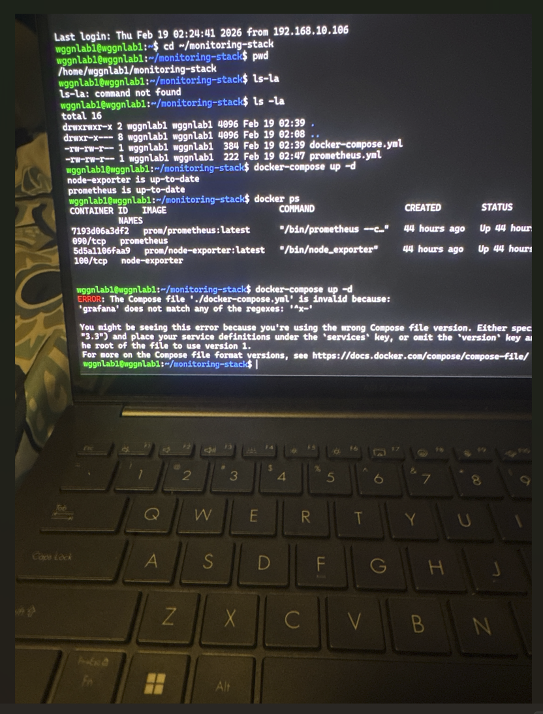
*docker-compose failing with "grafana does not match any of the regexes: ^x-" — caused by the deprecated version key in the Compose file*

**Error message:**
```
ERROR: The Compose file './docker-compose.yml' is invalid because:
'grafana' does not match any of the regexes: '^x-'
```

**Root cause:** The `version: "3"` key in docker-compose.yml is deprecated in Docker Compose v2.x and caused service keys to be treated as invalid.

**Fix:** Removed the `version:` line entirely. Stack came up cleanly on the next run.

---

### ❌ Issue 3 — `docker compose` vs `docker-compose` Command

**Error message:**
```
docker: unknown command: docker compose
```

**Root cause:** The system had the standalone `docker-compose` binary installed rather than the Docker Compose plugin. Running `docker compose` (space) failed but `docker-compose` (hyphen) worked.

**Fix:** Used `docker-compose` consistently throughout the project.

---

### ❌ Issue 4 — `sudo system` Typo

**Error message:**
```
sudo: system: command not found
```

**Root cause:** Typed `sudo system start fail2ban` instead of `sudo systemctl start fail2ban`.

**Fix:** Corrected to `sudo systemctl start fail2ban`.

---

## Key Lessons Learned

- **YAML is unforgiving** — a single indentation error in prometheus.yml caused repeated parse failures. Always validate YAML before deploying.
- **Docker Compose versioning changed** — the `version:` key was deprecated in Compose v2. Removing it resolved the grafana error immediately.
- **Monitoring confirms attacks work** — the Grafana traffic spike during the Hydra test proved the stack was capturing real security events, not just background noise.
- **Fail2ban is essential on any SSH-exposed host** — automated ban logic closes the gap that tools like Hydra are designed to exploit.
- **Physical labs teach differently than VMs** — working with real hardware, real cables, and real switch ports builds a different kind of understanding.
- **Document as you go** — screenshots taken during troubleshooting became the most valuable part of this documentation.

---

## IP Address Reference

| Host | IP Address | Role |
|---|---|---|
| OPNsense WAN | 192.168.1.252 | Firewall WAN interface |
| OPNsense LAN | 192.168.10.1 | Default gateway for lab |
| Ubuntu Server (wggnlab1) | 192.168.10.102 | Prometheus, Grafana, Node Exporter host |
| Management Laptop | 192.168.10.50 | Windows client / OPNsense management |
| Kali Linux | 192.168.10.x | Security testing machine |

---

## Repository Structure

```
wggn-homelab/
├── README.md
├── docker-compose.yml
├── prometheus.yml
└── screenshots/
    ├── Screenshot_2026-04-07-183628.png       (rack hardware photo)
    ├── Screenshot-2026-04-07_183142.png       (mini PC firewall close-up)
    ├── Screenshot-2026-04-07_183227.png       (network topology diagram)
    ├── Screenshot-2026-04-07_183305.png       (OPNsense interfaces overview)
    ├── Screenshot-2026-04-07_182922.png       (Windows network settings)
    ├── Screenshot-2026-04-07_183343.png       (Ubuntu server stats + docker ps)
    ├── Screenshot-2026-04-07_181131.png       (docker-compose ps all up)
    ├── Screenshot-2026-04-07_183038.png       (Grafana network traffic dashboard)
    ├── Screenshot-2026-04-07_183055.png       (Grafana netstat panel)
    ├── Screenshot_2026-04-07_190359.png       (nmap scan - username redacted)
    ├── Screenshot_2026-04-07_190421.png       (Hydra brute force - username redacted)
    ├── Screenshot-2026-04-07_183319.png       (fail2ban install)
    ├── Screenshot_2026-04-07-183126.png       (Prometheus YAML parse error)
    └── Screenshot_2026-04-07-183244.png       (docker-compose grafana error)
```

---

*Lab built and documented February–April 2026. All testing performed on an isolated private LAN (192.168.10.0/24). No public-facing services were exposed during this project.*
